# SIH26014 — Integrated GIS-based Digital Public Infrastructure for Land Governance

## Software Architecture Document

**Document:** `architecture.md`  
**Status:** Proposed Architecture / Architectural Source of Truth  
**Scope:** Software architecture, interoperability, GIS, spatial data, state integration, and system flows  
**Problem Statement:** SIH26014 — *An lntegrated GIS-based Digital Public lnfrastructure for Land Governance*

---

# 1. Architecture Overview

## 1.1 Purpose

This document defines the proposed software architecture for SIH26014.

The architecture is based on the conclusions reached from the SIH26014 problem statement, the project research, and the study of RBI's Land Records Service (LRS) architecture.

The central architectural decision is:

> **The platform is a federated, parcel-centric GIS interoperability platform. It does not replace state land-record systems and does not require a single centralized national database containing all land records.**

SIH26014 identifies fragmentation between cadastral maps, Record of Rights (RoR), registration records, land use, master plans, building permissions, restrictions, taxation, utilities, and other departmental datasets. It also explicitly recognizes that land administration differs between states in database structures, formats, units, language, terminology, and workflows.

Therefore, the architecture places an **interoperability layer between existing authoritative systems and applications**.

The core platform provides:

- a common parcel-centric model
- GIS and spatial services
- common administrative references
- common API contracts
- state-specific adapters
- identifier resolution
- data normalization
- CRS transformation
- provenance and validation
- asynchronous integration where required
- unified parcel visualization
- spatial analysis
- watershed and remote-sensing analysis
- citizen and government-facing services

The architecture deliberately avoids rebuilding existing state land-record applications.

---

## 1.2 Architectural Principle

The entire system can be summarized as:

```text
                    USERS / APPLICATIONS
                            │
                            ▼
                    COMMON API LAYER
                            │
                            ▼
                    CORE PLATFORM
                            │
              ┌─────────────┴─────────────┐
              │                           │
              ▼                           ▼
        GIS / PARCEL DOMAIN        LAND SERVICES
              │                           │
              └─────────────┬─────────────┘
                            ▼
                INTEROPERABILITY LAYER
                            │
          ┌─────────────────┼─────────────────┐
          │                 │                 │
          ▼                 ▼                 ▼
     STATE ADAPTER     STATE ADAPTER     STATE ADAPTER
          │                 │                 │
          ▼                 ▼                 ▼
     STATE SYSTEMS      STATE SYSTEMS      STATE SYSTEMS
```

The **core platform knows common concepts**.

The **State Adapter knows state-specific implementations**.

This boundary is fundamental.

---

# 2. Architectural Goals and Constraints

## 2.1 Goals

The architecture must:

1. Provide a map-first land interface.
2. Support navigation from India to an individual parcel.
3. Make the parcel the central spatial object.
4. Integrate cadastral geometry with land-governance information.
5. Work across heterogeneous state systems.
6. Preserve state-specific identifiers and terminology.
7. Provide standardized concepts without destroying source semantics.
8. Support different state APIs and integration mechanisms.
9. Support different state CRS and coordinate systems.
10. Enable GIS operations across normalized spatial datasets.
11. Support rural and urban contexts.
12. Integrate watershed and other environmental/spatial datasets.
13. Support satellite and remote-sensing analysis.
14. Preserve source provenance and traceability.
15. Allow a new state to be integrated without rewriting the core platform.
16. Keep authoritative land records in their appropriate source systems.
17. Support secure, role-based access.
18. Support synchronous and asynchronous integration.
19. Provide a scalable architecture for nationwide participation.

SIH26014 explicitly calls for open APIs, standardized metadata, secure authentication, role-based access controls, audit trails, GIS visualization, and scalable architecture.

---

## 2.2 Hard Constraints

### Constraint 1 — No giant national land-record database

The platform must **not** become a centralized replacement for state land-record systems.

Instead:

```text
State remains authoritative
          │
          ▼
State Adapter
          │
          ▼
National/common interoperability layer
```

The project research identifies the national interoperability gap as the more appropriate target than re-digitizing or replacing existing state systems.

### Constraint 2 — State systems are heterogeneous

The architecture cannot assume that every state has:

- the same API
- the same database
- the same parcel identifier
- the same administrative terminology
- the same schema
- the same CRS
- the same workflow
- the same data availability

### Constraint 3 — The core platform must remain state-agnostic

The core should never contain logic such as:

```text
if state == Kerala:
    ...
elif state == Maharashtra:
    ...
elif state == Karnataka:
    ...
```

State-specific behavior belongs inside adapters.

### Constraint 4 — Source systems remain authoritative

The platform can integrate, visualize, normalize, index, analyze, and cache information.

It should not silently become the legal source of truth.

---

# 3. High-Level Architecture

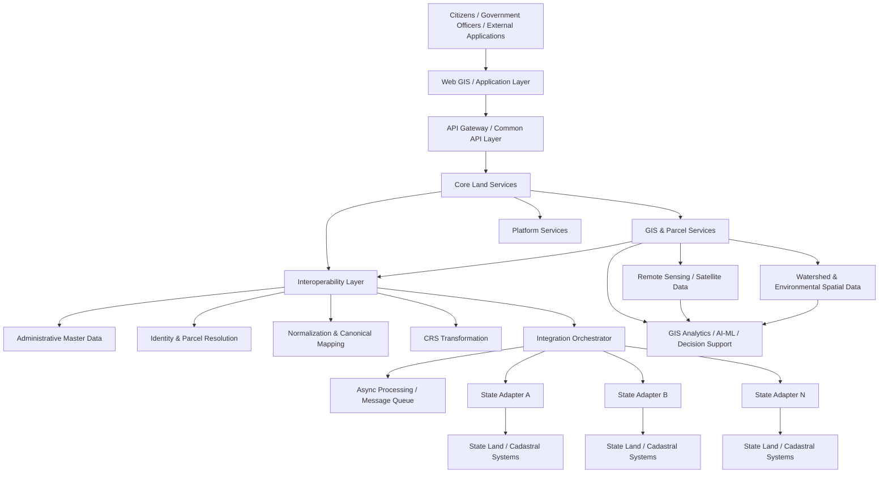

---

# 4. Major Components and Responsibilities

## 4.1 Web GIS / Application Layer

The first interface of the system is the **India map**.

The application provides:

- India map
- state navigation
- district navigation
- sub-district navigation
- village/town navigation
- parcel visualization
- parcel selection
- parcel information
- thematic GIS layers
- watershed visualization
- spatial analysis interfaces
- citizen services
- government dashboards

The frontend does not communicate directly with state databases.

```text
Frontend
    │
    ▼
Common API
    │
    ▼
Core Services
```

---

# 4.2 API Gateway

The API Gateway is the controlled entry point into the platform.

Responsibilities include:

- authentication
- authorization
- routing
- API versioning
- request validation
- rate limiting
- request tracing
- audit logging
- response handling

The gateway separates external consumers from internal service implementation.

---

# 4.3 Core Land Services

Core services expose standardized land concepts.

Examples:

```text
Parcel Service
Administrative Service
Land Record Service
Registration Service
Planning Service
Building Permission Service
Restriction Service
Tax Service
Utility Service
Workflow Service
Search Service
```

The service layer should expose **common concepts**, not state-specific database structures.

---

# 4.4 GIS and Parcel Services

The GIS domain manages the spatial foundation.

Responsibilities:

- parcel geometry
- spatial queries
- parcel visualization
- administrative boundaries
- spatial indexing
- geometry validation
- spatial relationships
- map layer generation
- GIS transformations
- spatial analysis

The cadastral parcel is the primary spatial object.

SIH26014 explicitly describes georeferenced cadastral maps, parcel boundaries, and unique parcel identifiers such as ULPIN as the base layer.

---

# 4.5 Platform Services

Platform services provide functionality shared across all domains:

- master data
- identity management
- metadata
- provenance
- audit
- notifications
- configuration
- workflow state
- integration monitoring
- error management

---

# 4.6 Interoperability Layer

This is the architectural heart of the platform.

It absorbs differences between state systems.

```text
                 CORE PLATFORM
                       │
                Common Contract
                       │
             Interoperability Layer
                       │
       ┌───────────────┼───────────────┐
       ▼               ▼               ▼
 Kerala Adapter   Karnataka Adapter   Maharashtra Adapter
       │               │               │
       ▼               ▼               ▼
 Kerala Systems   Karnataka Systems   Maharashtra Systems
```

The interoperability layer contains:

- State Adapter Registry
- request transformation
- response transformation
- identifier mapping
- terminology mapping
- schema mapping
- validation
- normalization
- CRS transformation
- authentication handling
- integration orchestration
- retries
- error handling
- provenance tracking

---

# 5. India → State → District → Village → Parcel Navigation

The primary user interaction is map-based.

The conceptual hierarchy is:

```text
India
 │
 ├── State
 │    │
 │    ├── District
 │    │    │
 │    │    ├── Sub-District
 │    │    │    │
 │    │    │    ├── Village
 │    │    │    │    │
 │    │    │    │    └── Parcel
 │    │    │    │
 │    │    │    └── Parcel
 │    │    │
 │    │    └── Village
 │    │
 │    └── District
 │
 └── Other States
```

The terminology can vary by state.

For example, one state may use:

```text
District → Taluk → Village
```

while another may use:

```text
District → Tehsil → Village
```

The **administrative hierarchy is standardized semantically**, while local names are preserved.

---

## 5.1 Zoom-dependent map behavior

The map should not render every parcel across India at once.

Instead:

```text
ZOOM LEVEL
    │
    ├── India
    │      → State boundaries
    │
    ├── State
    │      → District boundaries
    │
    ├── District
    │      → Sub-district boundaries
    │
    ├── Sub-district
    │      → Villages / towns
    │
    ├── Village / Town
    │      → Parcel boundaries
    │
    └── Parcel
           → Selected parcel + information
```

This is a GIS rendering and query optimization strategy.

---

# 6. Administrative Data and Identifier Strategy

## 6.1 The problem

Indian states use different administrative names and identifiers.

Similarly, land parcels have state-specific identifiers such as:

- Survey Number
- Survey/Subdivision Number
- Khasra Number
- Dag Number
- Plot Number
- Khata/Khatauni
- Patta
- Thandaper
- other local identifiers

The project research confirms that there is no single local parcel identifier that can simply replace all state identifiers.

---

## 6.2 Two-level identifier strategy

The architecture distinguishes between:

### Standardized identifiers

Examples:

```text
State Code
District Code
Sub-District Code
Village Code
ULPIN
```

### State-specific identifiers

Examples:

```text
Survey Number
Khasra Number
Dag Number
Plot Number
Thandaper Number
Khata Number
```

The architecture stores the relationship rather than forcing all identifiers into one naming convention.

```text
                    PARCEL
                      │
                 ULPIN / Common ID
                      │
       ┌──────────────┼──────────────┐
       │              │              │
   State ID      Local Parcel ID   Source ID
       │              │              │
    Kerala        Survey No.     Source system
```

---

## 6.3 Identifier Resolution

A request may arrive using:

```text
ULPIN
```

or:

```text
State + District + Village + Survey Number
```

or another state-specific identifier.

The platform resolves the request into the canonical parcel identity.

```text
User Identifier
       │
       ▼
Identifier Resolution
       │
       ├── ULPIN
       ├── Local identifier
       ├── Administrative context
       └── Source reference
       │
       ▼
Canonical Parcel Identity
```

---

# 7. State Integration Architecture

## 7.1 Core Principle

The core platform must never directly depend on an individual state's implementation.

Instead:

```text
Core Platform
      │
      ▼
Common Integration Contract
      │
      ▼
State Adapter
      │
      ▼
State-specific interface
      │
      ▼
State system
```

This allows the same core system to support many states.

---

## 7.2 State Integration Variability

A state might expose:

```text
REST API
```

Another might expose:

```text
OGC/WFS service
```

Another:

```text
State-specific GIS API
```

Another:

```text
Secure batch/file exchange
```

Another may require an institutional integration mechanism that is not publicly exposed.

The architecture does not assume one mechanism.

The State Adapter hides that difference.

The project research specifically identifies the scarcity and heterogeneity of publicly documented state land APIs and integration mechanisms.

---

# 8. State Adapter Design

## 8.1 Responsibilities

A State Adapter is **not merely a coordinate converter**.

It is the boundary between the common platform and a particular state's implementation.

It handles:

1. API/interface differences
2. Authentication differences
3. Request field mapping
4. State-specific identifiers
5. Administrative identifiers
6. Terminology mapping
7. Schema mapping
8. Unit conversion
9. Language/transliteration where necessary
10. Response transformation
11. CRS transformation where required
12. State-specific error handling
13. State-specific workflow behavior
14. Source metadata
15. Provenance

---

## 8.2 Adapter Boundary

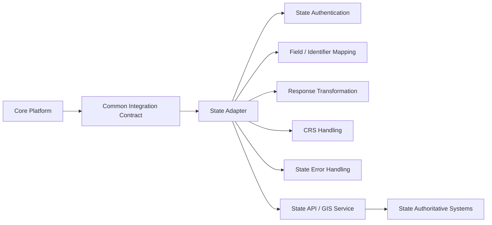

---

## 8.3 Common Contract

The core platform may conceptually request:

```text
getParcels(
    administrative_context,
    spatial_extent
)
```

The adapter converts this into the state-specific request.

For example:

```text
CORE REQUEST
    ↓
State Adapter
    ↓
State-specific parameters
    ↓
State system
```

The core never needs to know how the state implemented its backend.

---

# 9. Canonical Data Model

## 9.1 Purpose

The canonical data model provides a common semantic representation.

It does **not** mean that every state's database must be redesigned to match it.

It means:

```text
State Schema
      ↓
State Adapter
      ↓
Canonical Model
      ↓
Core Services
```

---

## 9.2 Canonical Parcel

Conceptually:

```text
Parcel
├── canonical_id
├── ULPIN
├── administrative_context
├── geometry
├── CRS
├── local_identifiers[]
├── source_references[]
├── provenance
└── lifecycle
```

---

## 9.3 Governance relationships

```text
Parcel
 │
 ├── Geometry
 │
 ├── RoR / Rights
 │
 ├── Registration
 │
 ├── Encumbrances
 │
 ├── Land Use
 │
 ├── Zoning
 │
 ├── Building Permissions
 │
 ├── Restrictions
 │
 ├── Tax
 │
 ├── Utilities
 │
 └── Other spatial/governance datasets
```

This matches the parcel-centric structure required by SIH26014.

---

## 9.4 Provenance

Every integrated attribute should be traceable to its source.

Conceptually:

```text
Canonical Field
      │
      ├── source system
      ├── source record ID
      ├── source field
      ├── retrieval time
      ├── transformation applied
      └── confidence/status
```

This prevents the canonical layer from becoming an opaque replacement for source records.

---

# 10. Parcel Retrieval Flow

## 10.1 Map parcel retrieval

The map needs an operation equivalent to:

```http
GET /api/v1/parcels?bbox=<minLon,minLat,maxLon,maxLat>
```

This is a **common platform concept**, not a claim that every state exposes this exact endpoint.

The actual state may use a different mechanism.

---

## 10.2 End-to-end flow

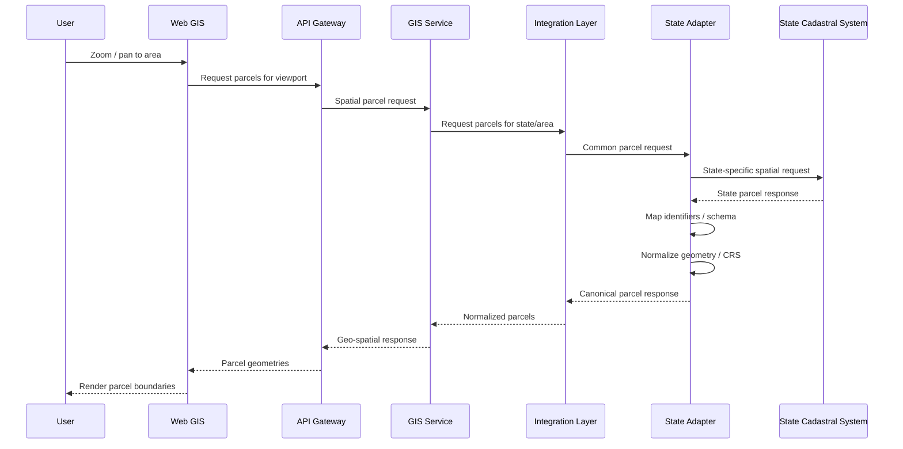

---

## 10.3 Example

The common platform might request:

```http
GET /api/v1/parcels?bbox=76.25,9.95,76.30,10.00
```

The state adapter might translate that into a completely different request.

For example, conceptually:

```text
Common request
    ↓
State Adapter
    ↓
district_code
village_code
spatial_extent
    ↓
State API
```

The exact state request is implementation-specific and remains outside the core platform.

---

# 11. Parcel Selection and Public Data Flow

Once a parcel is visible on the map, the user can click it.

The flow is different from map rendering.

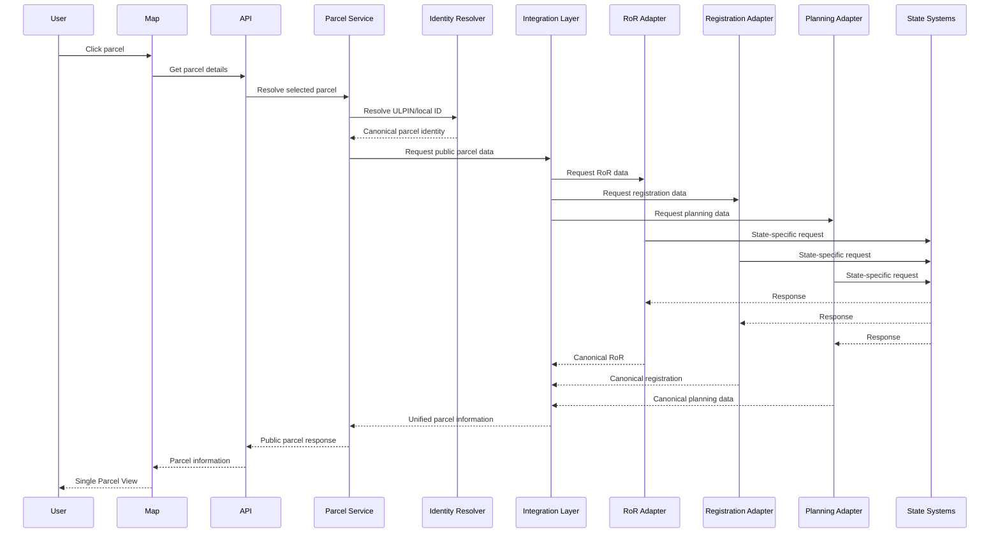

---

# 12. Geospatial / CRS Architecture

## 12.1 CRS principle

Different state systems and datasets may use different Coordinate Reference Systems.

Therefore:

> **The platform must not assume that all incoming spatial data is already in the same CRS.**

A source dataset may use:

```text
State/local projected CRS
```

while another may use:

```text
WGS 84
```

and web visualization may use:

```text
Web Mercator
```

These are not interchangeable.

---

## 12.2 CRS architecture

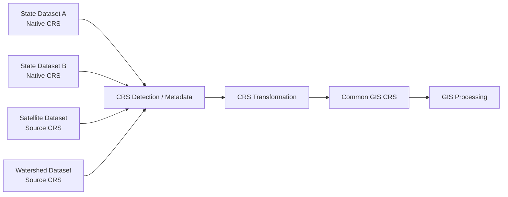

---

## 12.3 Preserve source CRS

The system should retain:

```text
source_crs
source_geometry
transformation_method
target_crs
transformation_timestamp
```

The transformed geometry is used for interoperable spatial operations, while the source representation remains traceable.

---

## 12.4 CRS transformation location

CRS handling can occur inside the State Adapter for state-specific source integration, or within a reusable geospatial transformation service.

The important architectural boundary is:

```text
Source spatial data
        ↓
CRS normalization
        ↓
Common spatial reference
        ↓
Cross-dataset GIS operations
```

The State Adapter should understand state-specific CRS requirements, while the actual transformation engine should remain reusable.

---

# 13. Spatial Data Architecture

The platform deals with several spatial data classes.

```text
Spatial Data
│
├── Administrative boundaries
│
├── Cadastral parcels
│
├── Watershed boundaries
│
├── Drainage
│
├── Water bodies
│
├── Land use / land cover
│
├── Vegetation
│
├── Soil
│
├── Roads / infrastructure
│
├── Utility networks
│
├── Buildings
│
├── Environmental restrictions
│
└── Satellite / remote-sensing datasets
```

---

## 13.1 Administrative layers

These establish geographic context:

```text
India
State
District
Sub-District
Village / Town
```

They are used for:

- navigation
- filtering
- spatial indexing
- access control
- data organization
- query routing

---

## 13.2 Cadastral layer

The cadastral layer provides:

```text
Parcel boundary
Parcel geometry
Parcel identifier
Administrative context
Source reference
```

This is the primary land spatial layer.

---

## 13.3 Thematic layers

Thematic layers can be spatially related to parcels.

For example:

```text
Parcel
   │
   ├── Land use
   ├── Zoning
   ├── Watershed
   ├── Drainage
   ├── Water body
   ├── Soil
   ├── Vegetation
   ├── Flood/restriction zone
   └── Infrastructure
```

The relationship may be:

```text
parcel contains feature
parcel intersects feature
parcel is within feature
feature is near parcel
```

It should not always be represented as a direct database foreign key because many spatial relationships are geometric rather than one-to-one.

---

# 14. GIS Processing Architecture

GIS processing is separated from state-specific integration.

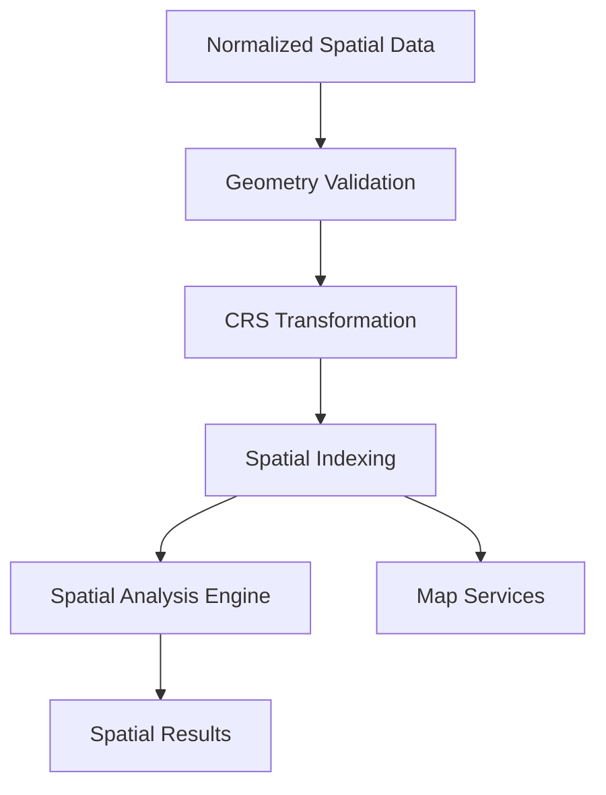

---

## 14.1 Core GIS operations

The reusable GIS layer can support:

- intersection
- containment
- proximity
- buffering
- overlay
- clipping
- area calculation
- spatial filtering
- geometry validation
- topology checks
- parcel-to-watershed relationship
- parcel-to-drainage relationship
- parcel-to-water-body relationship
- parcel-to-land-use relationship
- parcel-to-restriction relationship

---

## 14.2 Example

A user selects a parcel.

The platform can determine:

```text
Parcel P
 │
 ├── belongs to Village V
 ├── belongs to Watershed W
 ├── intersects Drainage D
 ├── lies within Land Use Zone L
 ├── intersects Restriction Zone R
 └── is near Water Body B
```

These relationships are computed spatially rather than requiring every dataset to use the same schema.

---

# 15. Watershed / Remote-Sensing Analysis Architecture

The land-governance platform also needs to support watershed-related spatial analysis.

This is an **analytics layer above the core parcel interoperability architecture**.

The project research and SIH26014 requirements identify GIS integration and the potential use of satellite imagery, change detection, predictive analytics, and decision-support capabilities.

---

## 15.1 Watershed data model

```text
Watershed
│
├── Watershed Boundary
├── Sub-Watershed
├── Drainage Network
├── Streams
├── Water Bodies
├── Elevation / DEM
├── Soil
├── Land Use / Land Cover
├── Vegetation
├── Soil Moisture
├── Rainfall
└── Satellite-derived indicators
```

---

## 15.2 Parcel-watershed relationship

The cadastral system and watershed system are different spatial domains.

They are connected through GIS.

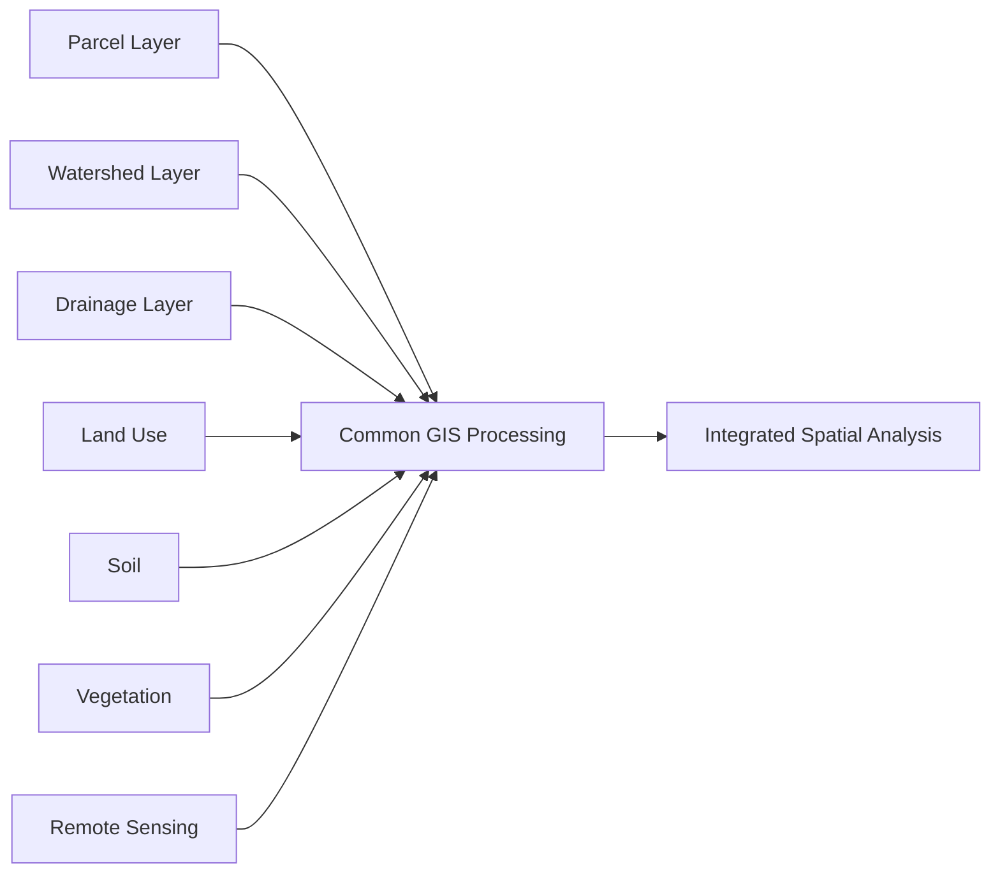

---

## 15.3 Example watershed analysis

```text
Selected Watershed
        │
        ├── Identify parcels
        │
        ├── Identify land-use classes
        │
        ├── Identify drainage
        │
        ├── Identify water bodies
        │
        ├── Analyze vegetation
        │
        ├── Analyze soil
        │
        ├── Analyze satellite changes
        │
        └── Generate decision-support indicators
```

---

## 15.4 Remote-sensing pipeline

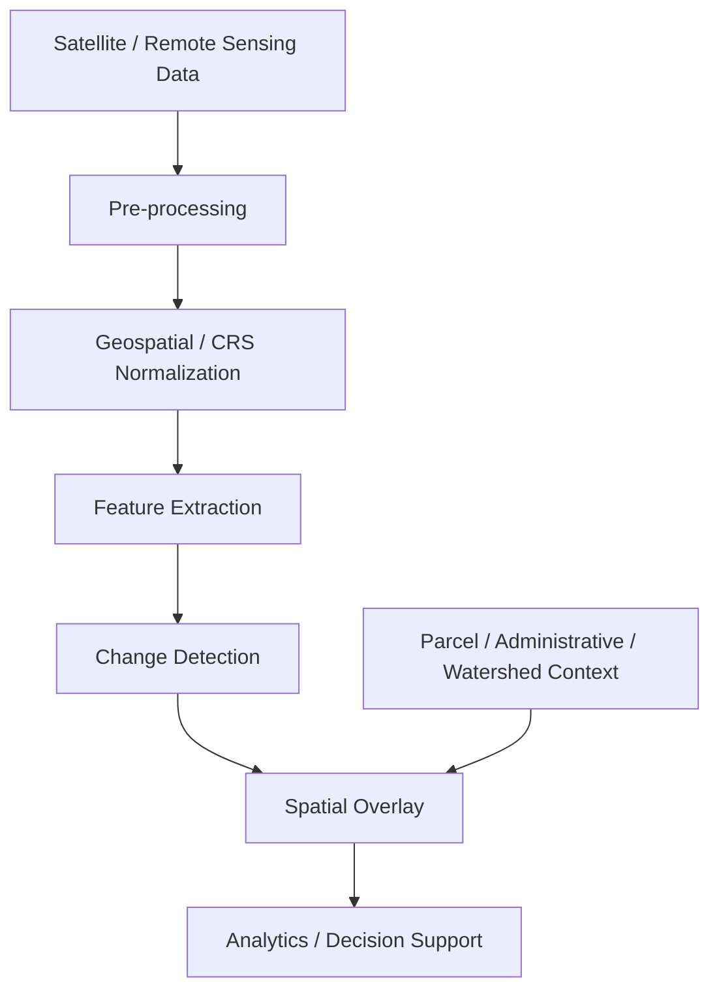

AI/ML can be used here for:

- feature extraction
- change detection
- anomaly detection
- classification
- predictive analysis

AI/ML is a supporting capability, not the foundation of the platform.

---

# 16. API Architecture

## 16.1 API layers

```text
External Consumers
       │
       ▼
Public / Partner API
       │
       ▼
API Gateway
       │
       ▼
Core Domain APIs
       │
       ▼
Integration APIs
       │
       ▼
State Adapters
```

---

## 16.2 Common API concepts

The API layer should expose common operations such as:

```text
GET /administrative-units
GET /parcels
GET /parcels/{id}
GET /parcels/{id}/geometry
GET /parcels/{id}/rights
GET /parcels/{id}/registration
GET /parcels/{id}/planning
GET /parcels/{id}/restrictions
GET /parcels/{id}/layers
```

These are **architectural examples**, not a finalized API specification.

The exact API paths, authentication mechanism, payload schema, versioning strategy, and OGC/service standards remain implementation decisions.

---

## 16.3 Spatial query API

The map requires a spatial query capability.

Conceptually:

```http
GET /api/v1/parcels?bbox=<minLon,minLat,maxLon,maxLat>
```

The request can also eventually support:

```text
administrative filters
ULPIN
local parcel ID
geometry
zoom level
layer
```

The core API must remain independent of how the underlying state system performs the query.

---

# 17. Data Ingestion and Normalization

Not every state system will necessarily provide real-time APIs.

Therefore, the architecture supports multiple integration modes.

```text
State Source
│
├── Real-time API
│
├── GIS service
│
├── Scheduled data feed
│
├── Secure file exchange
│
└── Other approved integration mechanism
        │
        ▼
State Adapter
        │
        ▼
Normalization
        │
        ▼
Canonical representation
```

---

## 17.1 Normalization pipeline


---

## 17.2 Source fidelity

Normalization must not destroy source meaning.

For example:

```text
Source field:
"Thandaper No."

Canonical concept:
holding_reference
```

The system should retain:

```text
source_field = "Thandaper No."
source_value = ...
canonical_field = "holding_reference"
```

This preserves traceability.

---

# 18. Caching / Asynchronous Processing

## 18.1 Why asynchronous processing is required

External state systems may have:

- variable response times
- availability constraints
- heavy processing
- asynchronous workflows
- rate limitations

Therefore, the platform should support both:

### Synchronous

For fast operations:

```text
Request
  ↓
State Adapter
  ↓
State API
  ↓
Response
```

### Asynchronous

For longer operations:

```text
Request
  ↓
Request ID
  ↓
Queue
  ↓
Processing
  ↓
State System
  ↓
Transformation
  ↓
Result
```

This follows the useful architectural pattern observed in RBIH's LRS, which separates request preparation, validation, execution, transformation and completion rather than assuming every provider responds immediately.

---

## 18.2 Integration job lifecycle

Conceptually:

```text
RECEIVED
   ↓
PREPARING
   ↓
VALIDATING
   ↓
EXECUTING
   ↓
TRANSFORMING
   ↓
COMPLETED
```

Failure:

```text
              ┌──→ FAILED
              │
VALIDATING → EXECUTING → ...
```

The exact implementation is an open decision.

---

## 18.3 Caching

Caching can be used for:

- administrative boundaries
- map tiles
- frequently accessed parcel geometry
- non-sensitive reference data
- approved public datasets
- expensive spatial computations

Caching must not silently turn into an uncontrolled copy of state land records.

A useful distinction is:

```text
Performance cache
      ≠
National authoritative land database
```

---

# 19. Storage Architecture

The architecture uses storage according to purpose.

## 19.1 Spatial / parcel storage

Used for the platform's operational spatial representation and indexing.

Potential capabilities include:

```text
PostgreSQL + PostGIS
```

or another spatial database supporting equivalent requirements.

The technology is not yet a hard architectural decision.

---

## 19.2 Platform operational storage

Stores:

```text
integration jobs
audit logs
configuration
metadata
API request state
workflow state
source references
administrative reference data
```

---

## 19.3 Source systems

State systems remain outside the core storage boundary.

```text
                    PLATFORM
              ┌─────────────────┐
              │ Spatial index   │
              │ Metadata        │
              │ Integration     │
              │ Workflow        │
              │ Audit           │
              └────────┬────────┘
                       │
                       │ references / queries
                       ▼
              STATE AUTHORITATIVE
                  SYSTEMS
```

---

## 19.4 What is deliberately not stored centrally

The architecture does not require:

```text
Entire Kerala RoR database
Entire Maharashtra registration database
Entire Karnataka land database
...
```

to be copied into one national database.

The system instead stores the information necessary for:

- interoperability
- spatial discovery
- indexing
- integration
- caching where justified
- provenance
- workflows
- analytics

while source systems remain authoritative.

---

# 20. Security and Access Control

## 20.1 Authentication

All protected APIs require authentication.

The exact identity provider is an implementation/open decision.

---

## 20.2 Authorization

Role-based access control:

```text
Citizen
   │
   └── Public information

Government Officer
   │
   └── Authorized departmental information

Administrator
   │
   └── Platform configuration

Integration Operator
   │
   └── Integration monitoring

Analytics User
   │
   └── Authorized analytical datasets
```

---

## 20.3 Data classification

The architecture should distinguish:

```text
Public
Restricted
Sensitive
Internal
```

Public parcel information should not automatically expose personal or sensitive information.

---

## 20.4 Audit

Important operations should produce audit events:

```text
Who
What
When
Which parcel
Which source
Which operation
Result
```

The audit system is especially important for a federated system because it provides traceability across system boundaries.

---

# 21. Reliability and Failure Handling

The core platform must assume that external systems can fail.

Possible failures:

```text
State API unavailable
Timeout
Invalid response
Authentication failure
Schema mismatch
Unknown identifier
CRS metadata missing
Invalid geometry
Rate limit
Partial response
```

---

## 21.1 Failure boundary

A state failure must not crash the entire national platform.

```text
                    Core Platform
                         │
        ┌────────────────┼────────────────┐
        │                │                │
    State A          State B          State C
        │                │                │
      FAIL              OK               OK
        │                │                │
   Isolated error       │                │
        │                │                │
        └───────────────┴────────────────┘
```

The user should receive a controlled status such as:

```text
"Registration information is temporarily unavailable."
```

rather than an application-wide failure.

---

## 21.2 Retry policy

Retries should be controlled and only used where appropriate.

The exact:

- retry count
- backoff
- timeout
- circuit breaker
- queue policy

remain implementation decisions.

---

# 22. Scalability

The architecture scales by adding adapters rather than rewriting the platform.

```text
                     CORE
                      │
              Common Contracts
                      │
       ┌──────────────┼──────────────┐
       ▼              ▼              ▼
   Adapter 1      Adapter 2      Adapter 3
       │              │              │
     State A        State B        State C

                      ...

                    Adapter N
                       │
                     State N
```

Adding State N should primarily involve:

1. implementing the adapter
2. registering its capabilities
3. configuring authentication
4. mapping identifiers
5. mapping schemas
6. defining source endpoints/services
7. defining CRS handling
8. defining administrative mappings
9. validating the integration

The core GIS and land services remain unchanged.

---

# 23. Deployment Architecture

The deployment can be cloud or government data-center based.

The architecture should not depend on a particular cloud provider.

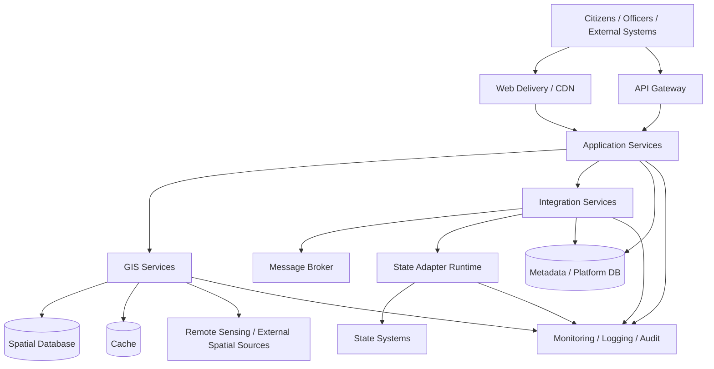

---

## 23.1 Logical deployment separation

The major runtime boundaries are:

```text
Presentation
    ↓
API
    ↓
Core Services
    ↓
GIS / Spatial Services
    ↓
Interoperability
    ↓
State Adapters
    ↓
External State Systems
```

State adapters may be deployed independently when security or network requirements demand it.

For example:

```text
National/Core Environment
        │
        │ secure connection
        ▼
State Adapter Environment
        │
        ▼
State Network
        │
        ▼
State System
```

The exact network topology depends on government integration requirements.

---

# 24. End-to-End System Flows

## 24.1 Flow A — Opening the application

```text
User
 ↓
Web application
 ↓
India map
 ↓
Administrative base layers
 ↓
User selects/zooms into State
```

---

## 24.2 Flow B — State to village navigation

```text
India
 ↓
State
 ↓
District
 ↓
Sub-District
 ↓
Village / Town
```

Administrative boundaries can be served from the platform's normalized administrative spatial layer.

---

## 24.3 Flow C — Viewing parcel boundaries

```text
Map viewport
 ↓
GIS parcel query
 ↓
Integration layer
 ↓
Relevant state adapter
 ↓
State cadastral source
 ↓
Parcel geometries
 ↓
Schema + identifier normalization
 ↓
CRS normalization
 ↓
GIS service
 ↓
Map
```

Where approved and appropriate, parcel geometry may instead be served from a maintained spatial index/cache to reduce repeated calls to source systems.

---

## 24.4 Flow D — Selecting a parcel

```text
User clicks parcel
 ↓
Parcel ID / ULPIN
 ↓
Identity resolution
 ↓
Core parcel service
 ↓
State adapters
 ├── RoR
 ├── Registration
 ├── Planning
 ├── Building
 ├── Restrictions
 └── Other public datasets
 ↓
Canonical model
 ↓
Unified Parcel View
```

---

# 25. Adding a New State

This is one of the most important scalability properties.

Suppose the system already supports:

```text
Kerala
Karnataka
Maharashtra
```

and a new state needs to be added.

The architecture becomes:

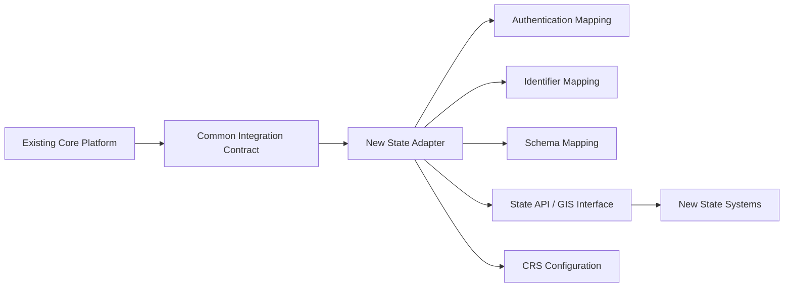

The core platform does not need to learn the internal implementation of the new state.

---

## 25.1 New-state integration process

```text
1. Study state systems
        ↓
2. Identify administrative identifiers
        ↓
3. Identify parcel identifiers
        ↓
4. Identify cadastral geometry source
        ↓
5. Identify RoR / registration / planning sources
        ↓
6. Identify integration interfaces
        ↓
7. Configure authentication
        ↓
8. Map state schema → canonical schema
        ↓
9. Configure CRS transformation
        ↓
10. Implement adapter
        ↓
11. Validate responses
        ↓
12. Register adapter
        ↓
13. Run integration tests
        ↓
14. Activate state
```

---

# 26. Key Architectural Boundary

The most important boundary in the entire system is:

```text
                  CORE PLATFORM
                         │
                CANONICAL MODEL
                         │
                COMMON CONTRACT
                         │
                STATE ADAPTER
                         │
              STATE-SPECIFIC MODEL
                         │
               STATE SYSTEMS
```

### Core platform knows:

```text
Parcel
ULPIN
Geometry
Administrative unit
Rights
Registration
Land use
Planning
Building
Restriction
Tax
Watershed
Spatial relationship
```

### State adapter knows:

```text
State API
State database structure
State authentication
State identifiers
State terminology
State field names
State workflows
State CRS
State response format
```

### Core platform must not know:

```text
Kerala-specific database tables
Maharashtra-specific API parameters
Karnataka-specific field names
State-specific internal implementation details
```

This is what allows the architecture to scale.

---

# 27. Relationship to RBI LRS Architectural Pattern

RBIH's Land Records Service was studied as an architectural reference, particularly for interoperability patterns.

The relevant architectural lessons are:

```text
Common consumer interface
        ↓
Provider-specific integration
        ↓
Provider-specific identifiers
        ↓
Validation
        ↓
Execution
        ↓
Transformation
        ↓
Standardized response
```

The LRS architecture demonstrates a provider-oriented approach where different state land-record providers can have different primary identifiers and required fields, while the common service abstracts those differences.

It also demonstrates the value of:

- provider abstraction
- master-data validation
- asynchronous processing
- normalization
- standardized response structures
- controlled error handling

The SIH26014 architecture adapts these **architectural principles**, rather than copying RBI's implementation.

---

# 28. Relationship Between Parcel Data and Watershed Data

These are separate spatial domains.

They should not be forced into a single source system.

```text
LAND DOMAIN
│
├── Cadastral parcels
├── RoR
├── Registration
├── Planning
└── Building

ENVIRONMENT / WATERSHED DOMAIN
│
├── Watersheds
├── Drainage
├── Water bodies
├── Soil
├── Vegetation
├── Land use
└── Remote sensing

                ↓

        COMMON GIS ENGINE

                ↓

        SPATIAL RELATIONSHIPS
```

This allows the platform to answer questions such as:

```text
Which parcels are inside this watershed?

Which parcels intersect this drainage?

What land-use classes occur inside this watershed?

Which parcels are near a water body?

What vegetation change occurred within a watershed?

Which administrative areas overlap a watershed?
```

These are GIS questions, not state-land-record database queries.

---

# 29. Data Ownership and Authority

The architecture follows a source-of-truth model.

```text
Parcel geometry source
        ↓
Authoritative cadastral source

Rights source
        ↓
Authoritative RoR/revenue source

Registration source
        ↓
Authoritative registration system

Planning source
        ↓
Planning authority

Tax source
        ↓
Tax authority
```

The integrated platform provides a unified view without claiming that it becomes the legal authority for every domain.

This is particularly important because the project research identifies state ownership and fragmented authority as fundamental characteristics of India's land administration environment.

---

# 30. What the Core Platform Actually Adds

The platform is not primarily creating another land-record application.

Its value is:

```text
Existing State Systems
        │
        │ fragmented
        ▼
┌────────────────────────────┐
│ SIH26014 INTEROPERABILITY  │
│                            │
│ Common identifiers         │
│ Canonical model            │
│ State adapters             │
│ GIS integration            │
│ CRS normalization          │
│ Spatial relationships      │
│ Common APIs                │
│ Provenance                 │
└──────────────┬─────────────┘
               │
               ▼
        Integrated View
```

The project research reaches the same broad conclusion: the stronger interpretation of SIH26014 is an interoperability layer over existing land systems rather than another centralized land-record database.

---

# 31. Architectural Decisions

## AD-001 — Federated architecture

**Decision:** Use a federated architecture.

**Reason:** Land systems remain state-specific and state-controlled.

**Consequence:** State adapters are mandatory architectural components.

---

## AD-002 — Parcel-centric architecture

**Decision:** Make the parcel the central spatial object.

**Reason:** Cadastral parcels provide the common spatial anchor for rights, registration, planning, taxation, utilities and other datasets.

---

## AD-003 — Map-first user experience

**Decision:** Start the application with an India map.

**Reason:** The system is fundamentally GIS-based and users navigate spatially.

---

## AD-004 — Administrative hierarchy

**Decision:** Support:

```text
India
→ State
→ District
→ Sub-District
→ Village/Town
→ Parcel
```

**Reason:** Administrative context is required to resolve and interpret state-specific identifiers.

---

## AD-005 — Common semantic model

**Decision:** Use a canonical model at the interoperability boundary.

**Reason:** State schemas and terminology differ.

**Consequence:** State adapters perform mapping into canonical concepts.

---

## AD-006 — Preserve state identifiers

**Decision:** Do not replace state-specific identifiers with a single local naming convention.

**Reason:** Local identifiers remain meaningful within their source systems.

**Consequence:** ULPIN/common identity and local identifiers coexist.

---

## AD-007 — State Adapter layer

**Decision:** Every state integration is isolated behind an adapter.

**Reason:** State systems differ in APIs, authentication, schemas, identifiers, terminology, CRS and workflows.

---

## AD-008 — CRS normalization

**Decision:** Support native source CRSs and transform spatial data into a common GIS reference before cross-dataset spatial operations.

**Reason:** Spatial interoperability requires more than matching attribute fields.

---

## AD-009 — GIS separate from state-specific logic

**Decision:** GIS processing is reusable and independent of individual state implementations.

**Reason:** Spatial operations such as intersection, buffering and overlay are common capabilities.

---

## AD-010 — Source systems remain authoritative

**Decision:** The platform does not replace authoritative state records.

**Reason:** The purpose is integration and access, not ownership transfer or re-creation of existing systems.

---

## AD-011 — Hybrid synchronous/asynchronous integration

**Decision:** Support both synchronous and asynchronous state interactions.

**Reason:** External systems have different latency, availability and processing characteristics.

---

## AD-012 — Controlled caching

**Decision:** Caching may be used for performance but is not equivalent to maintaining a national authoritative land database.

---

## AD-013 — Watershed as an independent spatial domain

**Decision:** Watershed, drainage, soil, vegetation, land-use and remote-sensing datasets remain separate spatial layers connected through GIS operations.

---

## AD-014 — AI/ML as supporting capability

**Decision:** AI/ML is not part of the core identity/integration foundation.

**Reason:** SIH26014 encourages AI/ML, satellite change detection and predictive analytics, but the core requirement is integrated land governance and interoperability.

---

# 32. Open Design Decisions

The following items were discussed conceptually but are **not yet finalized** and must not be treated as fixed implementation decisions.

## 32.1 Exact backend technology

Possible technologies include:

```text
PostgreSQL + PostGIS
```

and other equivalent spatial technologies.

**Status:** Open.

---

## 32.2 Exact API specification

The API examples in this document illustrate architectural concepts.

The final:

- endpoint naming
- payload schemas
- versioning
- authentication mechanism
- pagination
- error schema
- standards profile

must be specified separately.

**Status:** Open.

---

## 32.3 Exact national/common CRS

The architecture requires a common spatial reference for interoperable processing.

The exact production CRS strategy should be determined based on:

- intended operations
- accuracy requirements
- web visualization
- geospatial standards
- source data
- transformation accuracy

**Status:** Open.

---

## 32.4 Exact state integration mechanisms

Each state's available APIs, GIS services, authentication methods and data-sharing mechanisms must be verified individually.

The architecture deliberately does not assume that every state provides the same interface.

**Status:** Open.

---

## 32.5 Exact caching strategy

The architecture supports caching, but:

- what is cached
- how long
- whether it is spatially indexed
- invalidation mechanism
- source refresh policy

remain implementation decisions.

**Status:** Open.

---

## 32.6 Exact deployment topology

The platform may operate in:

- government infrastructure
- approved cloud infrastructure
- hybrid infrastructure

The final choice depends on deployment and security requirements.

**Status:** Open.

---

# 33. End-to-End Architecture Summary

The complete system can be understood as:

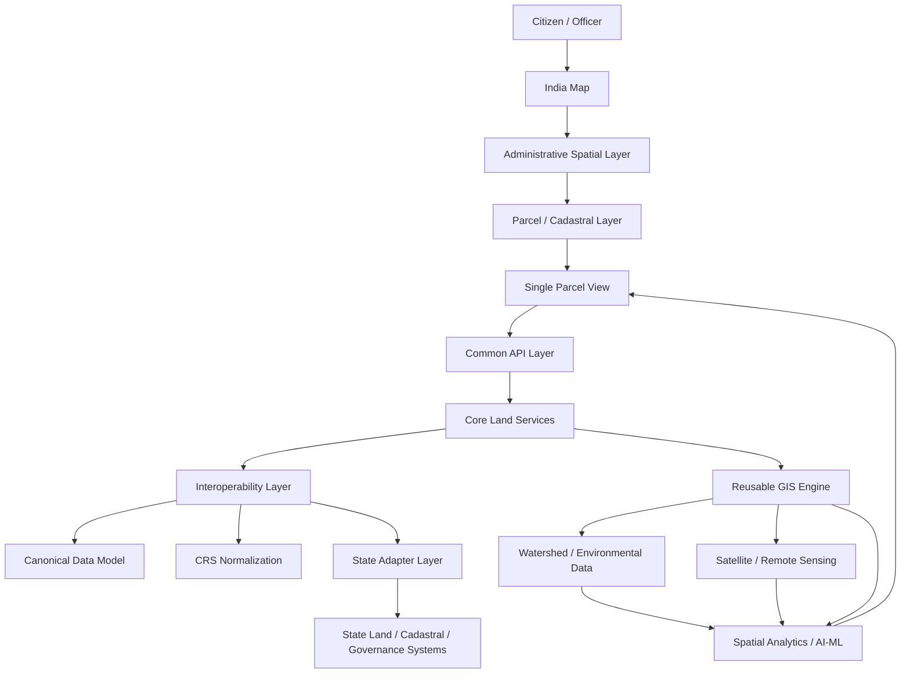

---

# 34. Final Architectural Model

The proposed SIH26014 architecture can ultimately be reduced to six fundamental ideas:

```text
                         INDIA MAP
                             │
                             ▼
                  ADMINISTRATIVE HIERARCHY
                             │
                             ▼
                         PARCEL
                             │
                    ULPIN / LOCAL IDs
                             │
                             ▼
                  COMMON GIS + DATA MODEL
                             │
                             ▼
                  STATE ADAPTER LAYER
                             │
             ┌───────────────┼───────────────┐
             ▼               ▼               ▼
          STATE A          STATE B         STATE N
          SYSTEMS          SYSTEMS         SYSTEMS
```

Around this core:

```text
                     ┌──────────────────┐
                     │   GIS ANALYTICS  │
                     └────────┬─────────┘
                              │
          ┌───────────────────┼───────────────────┐
          ▼                   ▼                   ▼
      Watershed           Satellite          Land Use
      Drainage            Vegetation         Soil
      Water Bodies        Change Detection    Restrictions
```

And across everything:

```text
Authentication
Authorization
Audit
Metadata
Provenance
Validation
Monitoring
APIs
```

---

# 35. Architectural Source of Truth

The definitive principle of this architecture is:

> **The core platform operates on standardized and canonical concepts, while State Adapters absorb the differences between individual state land and cadastral systems.**

Therefore:

```text
                    CORE PLATFORM
                         │
                  Common Interface
                         │
             ┌───────────┼───────────┐
             │           │           │
             ▼           ▼           ▼
        Kerala       Karnataka    Maharashtra
        Adapter       Adapter       Adapter
             │           │           │
             ▼           ▼           ▼
        State-specific land/cadastral systems
```

The **core does not need to know how Kerala works internally**.

The **core does not need to know how Maharashtra works internally**.

The **core does not need to know how a future State N works internally**.

Each adapter translates:

```text
COMMON
  ↓
STATE-SPECIFIC
```

and:

```text
STATE-SPECIFIC
  ↓
NORMALIZED
  ↓
COMMON
```

while preserving:

```text
source identity
source terminology
source provenance
source CRS
source semantics
```

This is what makes the system capable of scaling across India's heterogeneous land-governance ecosystem without requiring the replacement of the systems that already exist.

---

# 36. One-Line Architecture Definition

> **SIH26014 is architected as a federated, parcel-centric GIS interoperability platform in which a common canonical model, GIS layer, administrative identity framework, and API layer connect heterogeneous state land systems through state-specific adapters, while CRS normalization and reusable spatial processing enable integrated cadastral, governance, watershed, and remote-sensing analysis without creating a centralized national authoritative land-record database.**

---

# 37. Architectural References

The architecture is based on the following project research and source material:

- SIH 2026 problem statement JSON for SIH26014, including its stated requirements for cadastral maps, parcel boundaries, ULPIN, governance layers, APIs, interoperability, GIS visualization, security and scalable architecture.
- Project research identifying the principal gap as interoperability between existing state land systems rather than replacement by a centralized national database.
- Project research covering Indian land administration, parcel identity, ULPIN, CRS differences, DILRMP, NAKSHA, state systems and the federated integration approach.
- Project research documenting state API/data-exchange realities and the need for adapters and alternative integration mechanisms.
- Research material on RBIH Land Records Service architecture, including provider abstraction, validation, transformation and asynchronous processing patterns.
- Project research on GIS, watershed/remote-sensing analysis and the supporting role of AI/ML.

---

# 38. Status

**Architecture status:** Proposed and agreed conceptual architecture.

**Implementation status:** Not yet an implementation specification.

The following documents should be derived from this architecture rather than redefining it:

```text
API Specification
Data Model Specification
State Adapter Contract
GIS Specification
CRS Specification
Security Specification
Deployment Specification
UI/UX Specification
Prototype / Implementation Plan
```

Those documents may make implementation-specific choices where this architecture intentionally leaves them open, but they must preserve the architectural boundaries and decisions defined here.