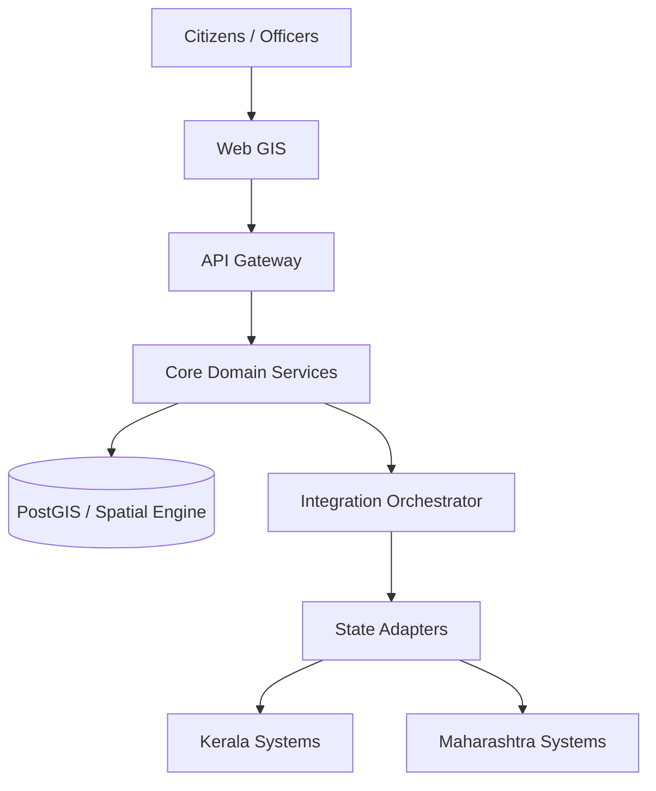

# SIH26014 — Integrated GIS-based Digital Public Infrastructure for Land Governance
**Document:** `architecture.md`  
**Status:** Architectural Source of Truth  
**Scope:** Domain overview, software architecture, technical stack, data storage, state integration, GIS, security model, and database schema.

---

## 1. Executive Summary
**SIH26014** is architected as a federated, parcel-centric GIS interoperability platform (often referred to as **Land Stack**). It utilizes a common canonical model, GIS layer, administrative identity framework, and API layer to connect heterogeneous state land systems through state-specific adapters. It employs CRS normalization and reusable spatial processing to enable integrated cadastral, governance, watershed, and remote-sensing analysis without creating a centralized national authoritative land-record database.

---

## 2. Domain Context (The Land Ecosystem)

### 2.1 What is Land and How is it Recorded?
In government records, land refers to a physical **parcel** with surveyed boundaries.
*   **Physical Land:** The actual ground, bounded by coordinates (geometry) obtained via surveying.
*   **Information/Records:** The legal rights, ownership (Record of Rights/RoR), and registration history tied to that physical land.
*   **The Problem:** Currently, land data is fragmented. The Survey Department holds the maps, the Revenue Department holds the RoR, and the Registration Department holds the sale deeds. These systems often use different identifiers and software.

### 2.2 ULPIN: The Anchor of Land Stack
The **Unique Land Parcel Identification Number (ULPIN)** (or Bhu-Aadhaar) is a 14-character alphanumeric code based on geocoordinates.
*   **Absolute Primary Key:** ULPIN is strictly mandatory in this architecture. Every parcel must have a ULPIN.
*   **Unchanging Spatial Identity:** Even if the owner changes or the state's internal "Survey Number" changes, the ULPIN remains identical unless the physical boundaries (geometry) change.

### 2.3 The Land Stack Layers
1.  **Base Layer (Spatial):** Georeferenced cadastral maps and parcel boundaries keyed by ULPIN.
2.  **Essential Layers (Governance):** Record of Rights (RoR), Registration data, Master plans, Encumbrances.
3.  **Additional Layers (Context):** Utilities, Property tax, Infrastructure, Watershed data.

---

## 3. Architectural Goals and Constraints

### 3.1 Hard Constraints
1.  **No Giant National Database:** The platform must **not** become a centralized replacement for state land-record systems.
2.  **State Systems Remain Authoritative:** The platform integrates, normalizes, and visualizes data, but it does not silently become the legal source of truth.
3.  **Heterogeneous States:** States use different APIs, databases, languages, and CRS (Coordinate Reference Systems). The core platform must remain completely **state-agnostic**.

### 3.2 Core Technological Stack
*   **Architecture Pattern:** Modular Monolith
*   **Backend Framework:** Java with Spring Boot
*   **Database:** PostgreSQL with PostGIS extension (via Hibernate Spatial)
*   **Task Scheduling:** Spring Boot native scheduling (Cron expressions)

---

## 4. Data Storage & Caching Strategy
To balance performance with the legal requirement of keeping state systems authoritative, the architecture employs a hybrid storage model:

1.  **Centralized Base Layer (Spatial Data):** 
    *   The platform stores parcel geometry (PostGIS polygons), ULPINs, and administrative identifiers in its central database.
    *   **Why:** To ensure high-performance map rendering, spatial indexing, and zooming. Vector tiles are served directly from our PostGIS database.
2.  **On-Demand Governance Data (Essential Layers):**
    *   The platform does **not** store RoR, Registration, or ownership details centrally. 
    *   **Why:** To prevent data staleness and legal liability. This data is fetched synchronously from state systems via State Adapters only when a user selects a specific parcel.

---

## 5. High-Level System Design



---

## 6. State Integration Architecture (State Adapters)
State Adapters act as the translation layer between the agnostic Core Platform and the specific state systems.

### 6.1 100% Configuration-Driven
*   State Adapters are strictly **configuration-driven** via the database.
*   **No custom code** is written per state.
*   The database stores API endpoints, authentication keys, and JSON payload schemas.

### 6.2 Data Mapping
The adapter relies on configuration tables to map state data to the Canonical Data Model:
*   **Field Mapping:** Translates `owner_nm_txt` to `owner_name`.
*   **Administrative Mapping:** Translates "Taluk" to "Sub-District".
*   **Identifier Mapping:** Links "Survey Number" to the canonical `local_parcel_id`.

### 6.3 Synchronization Mechanism (Polling)
*   The platform does **not** rely on states pushing webhooks when boundaries change.
*   Instead, synchronization is handled via **Periodic Polling**.
*   **Cron Configuration:** Sync frequency is configured per state using standard Cron Expressions (e.g., `0 0 * * 0`). Scheduled jobs fetch new parcel boundaries and update the central PostGIS database.

---

## 7. Geospatial & CRS Architecture
Different states survey land using different Coordinate Reference Systems (CRS) (e.g., local Cassini-Soldner projections vs. WGS84).

*   **CRS Normalization:** The State Adapter detects the incoming state CRS and transforms it into a common global reference system (WGS84 / EPSG:4326) for the canonical PostGIS database.
*   **Provenance:** The system records the original `source_crs` and the transformation method applied to ensure legal traceability.
*   **GIS Processing:** The decoupled spatial engine handles cross-dataset operations like intersection (e.g., determining which parcels lie within a specific watershed).

---

## 8. Security & Permissions (Frappe-Inspired RBAC)
The platform features a highly granular, metadata-driven permission system inspired by the Frappe Framework, implementing Matrix RBAC.

### 8.1 Resources & Roles
*   Instead of vague modules, permissions are mapped to specific **Resources** (Entities/DocTypes) like `STATE_ADAPTER`, `PARCEL`, or `SYNC_JOB`.
*   Users are assigned **Roles** (e.g., `INTEGRATION_ADMIN`), which grant base CRUD permissions.

### 8.2 User Permissions (Row-Level Security)
*   **Concept:** Separates *what* a user can do from *which records* they can access.
*   A user can be granted a User Permission restricting them to a specific context (e.g., `allow_type: state_code`, `for_value: KL`).
*   The backend automatically intercepts database queries and appends `WHERE state_code = 'KL'`, providing effortless multi-tenant data isolation.

### 8.3 Permlevels (Field-Level Security & PII Redaction)
*   Every field in the system is assigned an integer **`permlevel`** (e.g., Level `0` = Public, Level `1` = PII).
*   Roles are granted access to specific Permlevels.
*   **Enforcement:** When governance data is fetched dynamically, the API Gateway evaluates the user's role against the field's permlevel. If unauthorized, the API Gateway silently strips the field from the JSON response.

---

## 9. Database Schema

The following schema defines the core PostgreSQL + PostGIS implementation.

### 9.1 Administrative Hierarchy
```sql
CREATE TABLE states (
    state_code VARCHAR(2) PRIMARY KEY,
    name VARCHAR(100) NOT NULL
);

CREATE TABLE districts (
    district_code VARCHAR(10) PRIMARY KEY,
    state_code VARCHAR(2) REFERENCES states(state_code),
    name VARCHAR(100) NOT NULL
);
-- (Followed by sub_districts and villages)
```

### 9.2 Canonical Parcel (Base Layer)
```sql
CREATE TABLE parcels (
    ulpin VARCHAR(14) PRIMARY KEY,
    state_code VARCHAR(2) REFERENCES states(state_code),
    district_code VARCHAR(10) REFERENCES districts(district_code),
    village_code VARCHAR(10),
    local_parcel_id VARCHAR(100) NOT NULL,
    geom GEOMETRY(Polygon, 4326) NOT NULL,
    area_sqm NUMERIC(10, 2),
    created_at TIMESTAMP DEFAULT NOW(),
    updated_at TIMESTAMP DEFAULT NOW()
);
```

### 9.3 State Adapter Configuration
```sql
CREATE TABLE state_adapters (
    state_code VARCHAR(2) PRIMARY KEY REFERENCES states(state_code),
    base_url VARCHAR(255) NOT NULL,
    auth_type VARCHAR(20), -- 'API_KEY', 'OAUTH2'
    auth_credentials TEXT,
    status VARCHAR(20), -- 'ACTIVE', 'SUSPENDED'
    sync_cron_expression VARCHAR(100) -- e.g., '0 0 * * 0'
);

CREATE TABLE adapter_endpoints (
    id UUID PRIMARY KEY,
    state_code VARCHAR(2) REFERENCES state_adapters(state_code),
    capability VARCHAR(50) NOT NULL, -- 'ROR', 'REGISTRATION', 'GEOMETRY'
    path VARCHAR(255) NOT NULL,
    method VARCHAR(10) DEFAULT 'GET'
);

CREATE TABLE adapter_field_mappings (
    id UUID PRIMARY KEY,
    state_code VARCHAR(2) REFERENCES state_adapters(state_code),
    capability VARCHAR(50) NOT NULL,
    source_field VARCHAR(100) NOT NULL,
    canonical_field VARCHAR(100) NOT NULL
);
```

### 9.4 Security & Permissions (Frappe-Style)
```sql
CREATE TABLE users (
    user_id UUID PRIMARY KEY,
    username VARCHAR(50) UNIQUE,
    is_superadmin BOOLEAN DEFAULT false
);

CREATE TABLE roles (
    role_id VARCHAR(50) PRIMARY KEY,
    description VARCHAR(255)
);

CREATE TABLE user_roles (
    id UUID PRIMARY KEY,
    user_id UUID REFERENCES users(user_id),
    role_id VARCHAR(50) REFERENCES roles(role_id)
);

-- Row-Level Security / Context Binding
CREATE TABLE user_permissions (
    id UUID PRIMARY KEY,
    user_id UUID REFERENCES users(user_id),
    allow_type VARCHAR(50) NOT NULL, -- e.g., 'state_code'
    for_value VARCHAR(50) NOT NULL   -- e.g., 'KL'
);

CREATE TABLE resources (
    resource_name VARCHAR(50) PRIMARY KEY, -- e.g., 'STATE_ADAPTER'
    description VARCHAR(255)
);

-- Action and Field-level authorization
CREATE TABLE role_permissions (
    id UUID PRIMARY KEY,
    role_id VARCHAR(50) REFERENCES roles(role_id),
    resource_name VARCHAR(50) REFERENCES resources(resource_name),
    permlevel INTEGER DEFAULT 0,
    can_create BOOLEAN DEFAULT false,
    can_read BOOLEAN DEFAULT false,
    can_update BOOLEAN DEFAULT false,
    can_delete BOOLEAN DEFAULT false
);

CREATE TABLE canonical_fields (
    field_id VARCHAR(100) PRIMARY KEY,
    resource_name VARCHAR(50) REFERENCES resources(resource_name),
    data_type VARCHAR(20),
    permlevel INTEGER DEFAULT 0 -- 0=Public, 1=PII, etc.
);
```

### 9.5 Synchronization Jobs
```sql
CREATE TABLE sync_jobs (
    job_id UUID PRIMARY KEY,
    state_code VARCHAR(2) REFERENCES state_adapters(state_code),
    started_at TIMESTAMP NOT NULL,
    completed_at TIMESTAMP,
    status VARCHAR(20) NOT NULL, -- 'IN_PROGRESS', 'SUCCESS', 'FAILED'
    records_updated INTEGER,
    error_log TEXT
);
```
