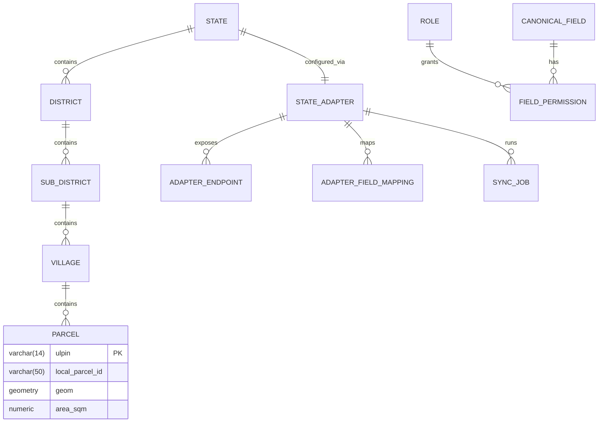

# Land Stack Database Schema

This document outlines the proposed database schema for the Core Platform using **PostgreSQL** with the **PostGIS** extension. The schema is divided into four main domains: Administrative Hierarchy, Canonical Parcel (Spatial), State Adapter Configuration, and Security & Permissions.

## Entity-Relationship Diagram

---

## 1. Administrative Hierarchy
Standardized semantic hierarchy to provide context for local identifiers.

### `states`
| Column | Type | Constraints | Description |
| :--- | :--- | :--- | :--- |
| `state_code` | `VARCHAR(2)` | PK | ISO 3166-2 code (e.g., 'KL', 'MH') |
| `name` | `VARCHAR(100)` | NOT NULL | Name of the state |

### `districts`
| Column | Type | Constraints | Description |
| :--- | :--- | :--- | :--- |
| `district_code` | `VARCHAR(10)` | PK | Standardized district code |
| `state_code` | `VARCHAR(2)` | FK -> states | State this district belongs to |
| `name` | `VARCHAR(100)` | NOT NULL | Name of the district |

*(Similar tables for `sub_districts` and `villages` follow this pattern)*

---

## 2. Canonical Parcel (Base Layer)
The spatial foundation of the platform. Represents the core map layer.

### `parcels`
| Column | Type | Constraints | Description |
| :--- | :--- | :--- | :--- |
| `ulpin` | `VARCHAR(14)` | PK | Unique Land Parcel Identification Number |
| `state_code` | `VARCHAR(2)` | FK -> states | |
| `district_code` | `VARCHAR(10)` | FK -> districts | |
| `village_code` | `VARCHAR(10)` | FK -> villages | |
| `local_parcel_id`| `VARCHAR(100)` | NOT NULL | The state's local ID (e.g., Survey No. 49/1) |
| `geom` | `GEOMETRY(Polygon, 4326)`| NOT NULL | Spatial boundary (PostGIS WGS84) |
| `area_sqm` | `NUMERIC(10, 2)` | | Area of the parcel in square meters |
| `created_at` | `TIMESTAMP` | DEFAULT NOW() | When the parcel was first synced |
| `updated_at` | `TIMESTAMP` | DEFAULT NOW() | Last boundary/attribute update |

---

## 3. State Adapter Configuration
Configuration-driven integration to avoid custom code per state.

### `state_adapters`
| Column | Type | Constraints | Description |
| :--- | :--- | :--- | :--- |
| `state_code` | `VARCHAR(2)` | PK, FK -> states | The state this adapter serves |
| `base_url` | `VARCHAR(255)` | NOT NULL | Root URL of the state's API |
| `auth_type` | `VARCHAR(20)` | | 'API_KEY', 'OAUTH2', 'BASIC' |
| `auth_credentials`| `TEXT` | | Encrypted secrets/tokens |
| `status` | `VARCHAR(20)` | | 'DRAFT', 'TESTING', 'ACTIVE', 'SUSPENDED' |
| `sync_cron_expression` | `VARCHAR(100)` | | e.g., '0 0 * * 0' for weekly |

### `adapter_endpoints`
| Column | Type | Constraints | Description |
| :--- | :--- | :--- | :--- |
| `id` | `UUID` | PK | |
| `state_code` | `VARCHAR(2)` | FK -> state_adapters | |
| `capability` | `VARCHAR(50)` | NOT NULL | 'ROR', 'REGISTRATION', 'GEOMETRY' |
| `path` | `VARCHAR(255)` | NOT NULL | e.g., `/api/v1/land/ror` |
| `method` | `VARCHAR(10)` | DEFAULT 'GET' | HTTP Method |

### `adapter_field_mappings`
| Column | Type | Constraints | Description |
| :--- | :--- | :--- | :--- |
| `id` | `UUID` | PK | |
| `state_code` | `VARCHAR(2)` | FK -> state_adapters | |
| `capability` | `VARCHAR(50)` | NOT NULL | 'ROR', 'REGISTRATION' |
| `source_field` | `VARCHAR(100)` | NOT NULL | Field name in State API (e.g. `owner_nm_txt`) |
| `canonical_field`| `VARCHAR(100)` | NOT NULL | Core platform field (e.g. `owner_name`) |
| `transformation` | `VARCHAR(50)` | | Optional (e.g., 'TO_UPPER', 'HECTARES_TO_SQM')|

---

## 4. Security & Permissions (Frappe-Inspired)
Implements a highly metadata-driven RBAC system utilizing Permlevels for field security and User Permissions for row-level (state-specific) security.

### `users`
| Column | Type | Constraints | Description |
| :--- | :--- | :--- | :--- |
| `user_id` | `UUID` | PK | |
| `username` | `VARCHAR(50)` | UNIQUE | |
| `email` | `VARCHAR(255)` | UNIQUE | |
| `is_superadmin`| `BOOLEAN` | DEFAULT false | Bypasses all permission checks |

### `roles`
| Column | Type | Constraints | Description |
| :--- | :--- | :--- | :--- |
| `role_id` | `VARCHAR(50)` | PK | e.g., 'INTEGRATION_ADMIN', 'REVENUE_OFFICER' |
| `description` | `VARCHAR(255)` | | |

### `user_roles`
Assigns base capabilities to a user.
| Column | Type | Constraints | Description |
| :--- | :--- | :--- | :--- |
| `id` | `UUID` | PK | |
| `user_id` | `UUID` | FK -> users | |
| `role_id` | `VARCHAR(50)` | FK -> roles | |

### `user_permissions` (Row-Level Security)
Restricts *which records* a user can access. If a user has a User Permission for `state_code` = 'KL', all their database queries will automatically append `WHERE state_code = 'KL'`.
| Column | Type | Constraints | Description |
| :--- | :--- | :--- | :--- |
| `id` | `UUID` | PK | |
| `user_id` | `UUID` | FK -> users | |
| `allow_type` | `VARCHAR(50)` | NOT NULL | The foreign key field (e.g., 'state_code') |
| `for_value` | `VARCHAR(50)` | NOT NULL | The allowed value (e.g., 'KL') |

### `resources` (Entities / DocTypes)
| Column | Type | Constraints | Description |
| :--- | :--- | :--- | :--- |
| `resource_name`| `VARCHAR(50)` | PK | e.g., 'STATE_ADAPTER', 'PARCEL', 'SYNC_JOB' |
| `description` | `VARCHAR(255)` | | |

### `role_permissions`
Defines what actions a role can take on a specific resource at a specific Permlevel.
| Column | Type | Constraints | Description |
| :--- | :--- | :--- | :--- |
| `id` | `UUID` | PK | |
| `role_id` | `VARCHAR(50)` | FK -> roles | |
| `resource_name`| `VARCHAR(50)` | FK -> resources| |
| `permlevel` | `INTEGER` | DEFAULT 0 | The field security level this rule applies to |
| `can_create` | `BOOLEAN` | DEFAULT false | |
| `can_read` | `BOOLEAN` | DEFAULT false | |
| `can_update` | `BOOLEAN` | DEFAULT false | |
| `can_delete` | `BOOLEAN` | DEFAULT false | |

### `canonical_fields` (With Permlevels)
| Column | Type | Constraints | Description |
| :--- | :--- | :--- | :--- |
| `field_id` | `VARCHAR(100)` | PK | e.g., 'ror.owner_name' |
| `resource_name`| `VARCHAR(50)` | FK -> resources| e.g., 'PARCEL' |
| `data_type` | `VARCHAR(20)` | | 'STRING', 'NUMBER', 'BOOLEAN' |
| `permlevel` | `INTEGER` | DEFAULT 0 | e.g., 0 for Public, 1 for PII, 2 for Financial |

---

## 5. Synchronization Jobs
Tracks the periodic polling events.

### `sync_jobs`
| Column | Type | Constraints | Description |
| :--- | :--- | :--- | :--- |
| `job_id` | `UUID` | PK | |
| `state_code` | `VARCHAR(2)` | FK -> state_adapters | |
| `started_at` | `TIMESTAMP` | NOT NULL | |
| `completed_at` | `TIMESTAMP` | | |
| `status` | `VARCHAR(20)` | NOT NULL | 'IN_PROGRESS', 'SUCCESS', 'FAILED' |
| `records_updated`| `INTEGER` | | Number of parcels updated/inserted |
| `error_log` | `TEXT` | | |
